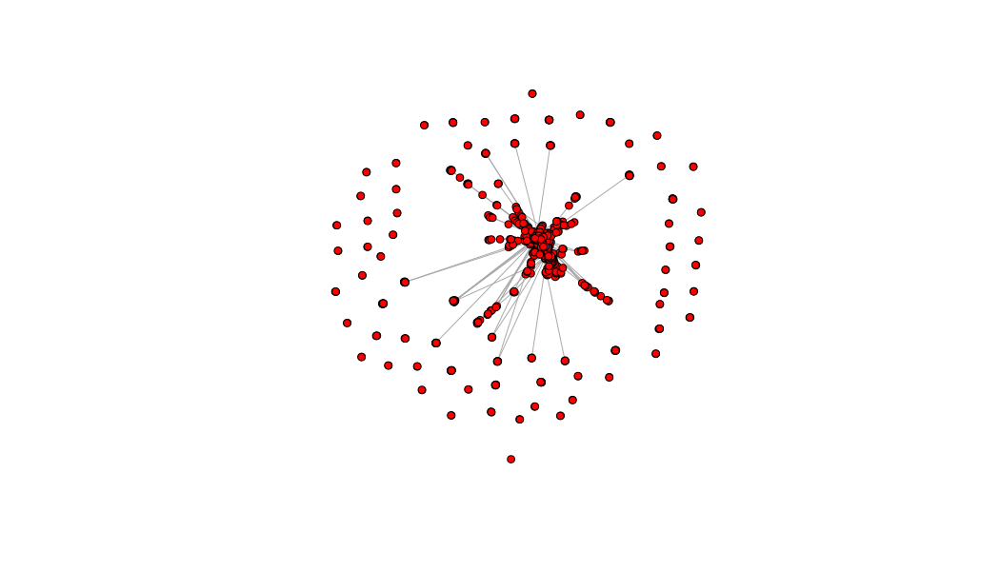

Actors in Open and Closed 2-stars (undirected network)
================

These scripts provide functions that extract from an undirected network all the open/closed triad/2stars. They list the ego and two alters.


Load example data
-----------------

To illustrate these functions, we use an ownership network, taken from Kogut (2012).

Kogut, B.M., 2012. The Small Worlds of Corporate Governance. MIT Press.

``` r
library(readxl)
library(magrittr)
library(igraph)
library(plyr)
##Download Files
download.file("http://www8.gsb.columbia.edu/kogut/data/US/US.Owners_2001.xls", destfile="US.Owners_2001.xls")

##Create Dataframe
ownershipDF<-read_excel("US.Owners_2001.xls")
ownershipDF2<-cbind(ownershipDF$owner,ownershipDF$coname) %>% as.data.frame(.,stringsAsFactors=FALSE)

##Create network from dataframe
ownershipNET<-graph_from_data_frame(DF,directed = FALSE)
```

Example network plot
--------------------

Below is a plot of the example network:



Open & Closed 2 stars
---------------------

From this ownership network we extract the open and closed triads/two stars.

``` r
source("UndirectedOpen2Star_function.R")

##List of open 2 stars
OpenOwnership<-UndirectedOpen2Star(ownershipNET)
head(OpenOwnership)

```

    ##                    Alter1                     Alter2
    ## 1 YORK INTERNATIONAL CORP CAPITAL RESEARCH & MGMT CO
    ## 2 YORK INTERNATIONAL CORP CAPITAL RESEARCH & MGMT CO
    ## 3 YORK INTERNATIONAL CORP CAPITAL RESEARCH & MGMT CO
    ## 4 YORK INTERNATIONAL CORP CAPITAL RESEARCH & MGMT CO
    ## 5 YORK INTERNATIONAL CORP CAPITAL RESEARCH & MGMT CO
    ## 6 YORK INTERNATIONAL CORP CAPITAL RESEARCH & MGMT CO
    ##                         Ego No.Ties
    ## 1               LIMITED INC       2
    ## 2                XEROX CORP       2
    ## 3    WILLIAMS COMPANIES INC       2
    ## 4             WESTVACO CORP       2
    ## 5 WESTERN GAS RESOURCES INC       2
    ## 6         WACHOVIA CORP NEW       2

``` r
source("UndirectedClosed2Star_function.R")

##List of closed 2 stars
ClosedOwnership<-UndirectedClosed2Star(ownershipNET)
head(ClosedOwnership)
```

    ##                               Alter1                     Alter2
    ## 12599      GALILEO INTERNATIONAL INC CAPITAL RESEARCH & MGMT CO
    ## 19690                    LIMITED INC            FMR CORPORATION
    ## 36334          MICRON TECHNOLOGY INC            FMR CORPORATION
    ## 57211  NEXTEL COMMUNICATIONS INC NEW            FMR CORPORATION
    ## 103263          STANDARD REGISTER CO     PUTNAM INVESTMENTS LLC
    ## 118206                    CONOCO INC                        AXA
    ##                          Ego No.Ties
    ## 12599           CENDANT CORP       3
    ## 19690   CHARMING SHOPPES INC       3
    ## 36334  TEXAS INSTRUMENTS INC       3
    ## 57211           MOTOROLA INC       3
    ## 103263   FIFTH THIRD BANCORP       3
    ## 118206         CITIGROUP INC       3
